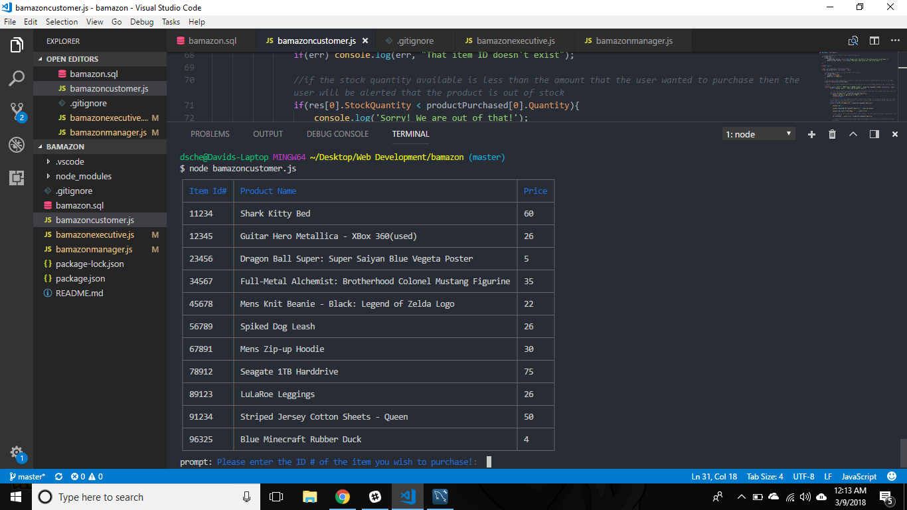
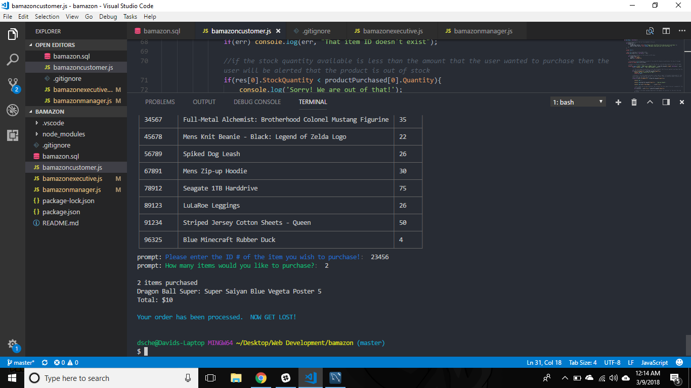
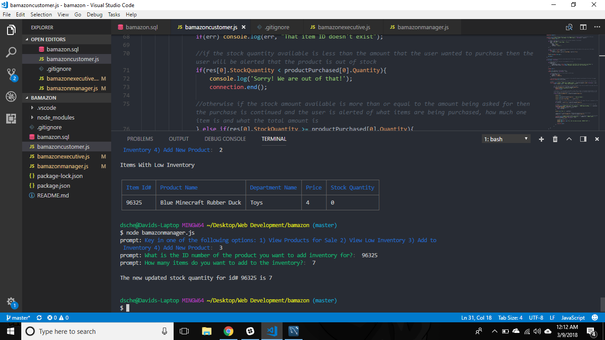
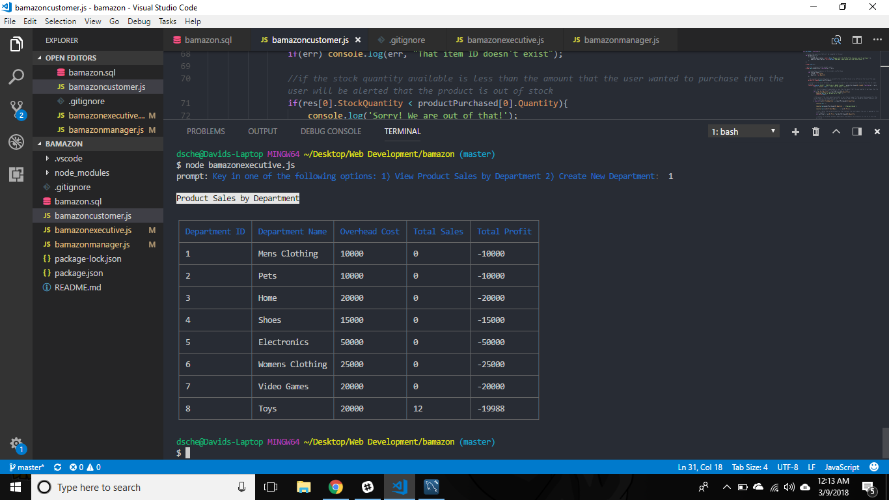

# bamazon
An Amazon Mock up run from the Command Line. Three apps running together: A Customer Side app, A manager app, and an Executive app.

Demo Video Here: https://youtu.be/x_BvqZW0kIM

Technologies Used: JavaScript, MySQL, NodeJS, NPM, Cli-table, Colors, Dotenv, Inquirer, and Prompt

On the Customer side you are able to view a table of items for sale. To choose an item, you enter the ID of the item you want. It will ask you how many of those items you would like to purchase. After that, it will give you a total for the items.

On the manager side, you can view products for sale, view low inventory, refill inventory, and add new items for sale.

On the Executive Side, you can view products sales by department and create a new department.

